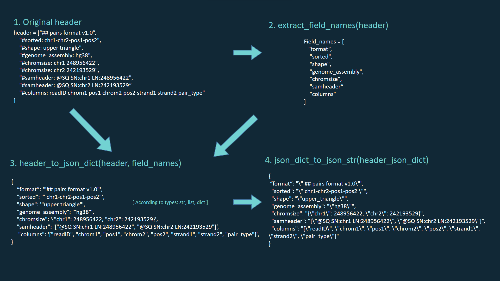

.. pairs_to_parquet documentation master file, created by
   sphinx-quickstart on Fri Oct 24 13:37:25 2025.
   You can adapt this file completely to your liking, but it should at least
   contain the root `toctree` directive.

Overview
==============================

`pairs_to_parquet` is a .parquet extention of .pairs file format.

The main purpose of this extension is to leverage the row groups and metadata features of the Parquet format in order to:

- speed up data selection, filtering and sorting
- address a minor limitation of the .pairs format, where metadata cannot be easily parsed by generic CSV readers
- reduce storage space required for the data 
- improve I/O performance

The main problem was to find a tool, which will be able to store additional metadata in .parquet file. 
`Duckdb` was  a perfect tool to do so, in particularly able to store key-value metadata.
Here is, how the process is organised:

.. raw:: html

     

.. toctree::
   :maxdepth: 2
   :caption: Contents:

   quickstart.md

.. toctree::
   :maxdepth: 2
   :caption: Tutorials

   tutorials/sort.ipynb
   tutorials/pairs_to_parquet.ipynb
   tutorials/parquet_to_pairs.ipynb